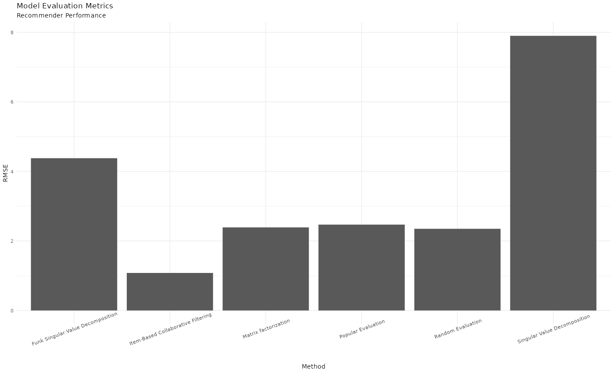

# Recommender System

## Book Recommender

Recommender systems are everywhere.

This project utilizes the Book-Crossing Dataset from [ Institut für Informatik, Universität Freiburg](http://www2.informatik.uni-freiburg.de/~cziegler/BX/) to recommend books.

I tested the performance of the following recommenders:

* Random
* Popular
* Matrix Factorization (MF / LIBMF)
* Singular Value Decomposition (SVD)
* Funk Singular Value Deomposition (SVDF)
* Item-based collaborative filtering (IBCF)

Below are the performance metrics according to RMSE

IBCF is the winner in this analysis, which can be used for recommendations to new users.

### TO-DO

In follow up stages (in collaboration with [Murat Ardag](https://mmuratardag.github.io/)), the system

1. suggests/serves popular or random books to the user (to be implemented in the Shiny app)
2.1. the user rates these recommendations (this step is already implemented
2.2. this new input is fed into the system (this step is already implemented)
3. IBCF output is served to the new user (getting the output sub-step is implemented -- the remaining part be implemented in the Shiny app)